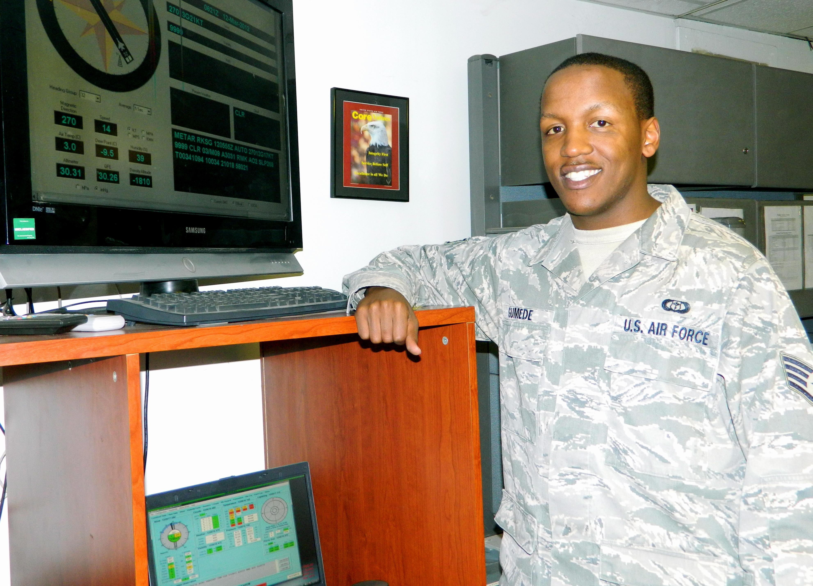

#   **Anathi Gumede** 

 Former education and training coordinator at one of New York City’s largest non-profit organizations serving people with histories of homelessness, incarceration, and substance abuse. Air Force Veteran, with over six years of world-wide weather technician experience, and five years ceremonial support in the National Capital region. Knowledge and ability to select, interpret and apply directives, policies, regulations, instructions and concepts on leadership and management.

#
Experience
* Ceremonial Guardsman
  - Bolling AFB, DC 2004-2008
  

 
 
 * Weather Forecaster
  - 2008-2015

 
  
 * Adult Education Teacher
    - The Doe Fund 2015-2017
#
Education
* Bachelor of Arts in Urban Studies                        
  Columbia University                                       
#                                                          
Projects
TBA
#
Volunteer Work
  1. Veterans Memorial Day Ruck March 2015
  2. NYC Hope Count 2017
  3. South Bronx Community Employment Fair 2018
_External References_
<https://www.linkedin.com/in/anathi-gumede-a18985a9//>

